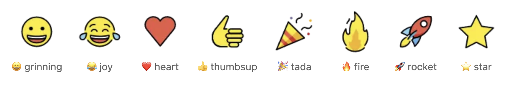
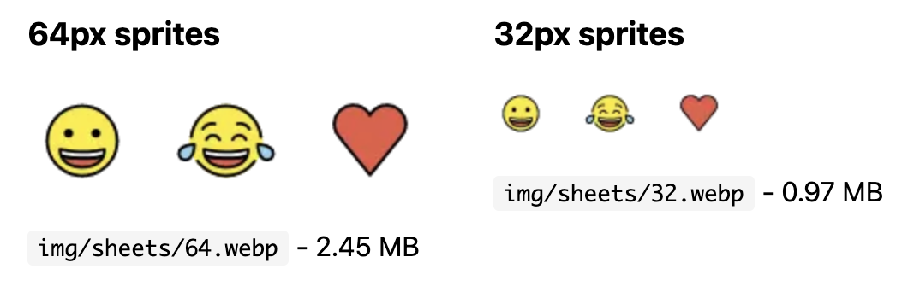

# emoji-datasource-openmoji

OpenMoji emoji sprite sheets compatible with [emoji-datasource](https://www.npmjs.com/package/emoji-datasource). Drop-in replacement for `emoji-datasource-apple`, `emoji-datasource-google`, or `emoji-datasource-twitter`.



## Features

- ✅ **Full compatibility** with emoji-datasource grid layout (62x62)
- ✅ **3,786 emojis** including 1,875 skin tone variants
- ✅ **Smaller file sizes** than Apple emoji sprites
  - 32px: 1.0 MB (vs 1.3 MB Apple)
  - 64px: 2.4 MB (vs 3.5 MB Apple)
- ✅ **Open source** OpenMoji design under CC-BY-SA 4.0
- ✅ **WebP format** for optimal compression

## Installation

```bash
npm install emoji-datasource-openmoji
```

or

```bash
pnpm add emoji-datasource-openmoji
```

## Usage

### As a drop-in replacement

If you're currently using `emoji-datasource-apple`:

```javascript
// Before
const emojiSheet = require('emoji-datasource-apple/img/apple/sheets/32.png');

// After
const emojiSheet = require('emoji-datasource-openmoji/img/sheets/32.webp');
```

### With emoji-datasource

```javascript
const emojiData = require('emoji-datasource');

// All emoji positions (sheet_x, sheet_y) from emoji-datasource
// work directly with the OpenMoji sprite sheets
const emoji = emojiData.find(e => e.short_name === 'grinning');
console.log(emoji.sheet_x, emoji.sheet_y); // Grid position in sprite sheet
```

### CSS Background Positioning

```css
.emoji {
  background-image: url('/path/to/emoji-sheet-32.webp');
  background-size: calc(34px * 62); /* (32px + 2px margin) * 62 grid cells */
  width: 32px;
  height: 32px;
}

.emoji-grinning {
  background-position-x: calc(var(--sheet-x) * -34px - 1px);
  background-position-y: calc(var(--sheet-y) * -34px - 1px);
}
```

## Available Sprite Sheets

- `img/sheets/32.webp` - 32×32px emojis (2108×2108px total)
- `img/sheets/64.webp` - 64×64px emojis (4092×4092px total)



## Building from Source

```bash
npm install
npm run build
```

This will:
1. Load emoji positions from `emoji-datasource`
2. Load corresponding OpenMoji SVGs
3. Generate sprite sheets at `img/sheets/*.webp`

## Grid Layout

The sprite sheets use a **62×62 grid** matching emoji-datasource:
- Each emoji has a 1px margin
- Cell size: emoji size + 2px margin
- Grid positions come from emoji-datasource's `sheet_x` and `sheet_y` values

## Skin Tone Support

All 1,875 skin tone variants are included:
- Fitzpatrick Type 1-2 (🏻)
- Fitzpatrick Type 3 (🏼)
- Fitzpatrick Type 4 (🏽)
- Fitzpatrick Type 5 (🏾)
- Fitzpatrick Type 6 (🏿)

## License

- **Sprite sheets & build script**: CC-BY-SA 4.0
- **OpenMoji designs**: CC-BY-SA 4.0 ([OpenMoji](https://openmoji.org))
- **Emoji data**: MIT ([emoji-datasource](https://github.com/iamcal/emoji-data))

## Credits

- [OpenMoji](https://openmoji.org) - Beautiful open source emoji designs
- [emoji-datasource](https://github.com/iamcal/emoji-data) - Emoji metadata and grid positions
- Built for [Orbital](https://github.com/alexg-g/Orbital-Desktop) - Private family social network

## Related Projects

- [emoji-datasource](https://www.npmjs.com/package/emoji-datasource) - Emoji metadata
- [openmoji](https://www.npmjs.com/package/openmoji) - Individual OpenMoji SVGs
- [openmoji-sprites](https://www.npmjs.com/package/openmoji-sprites) - Category-based sprite sheets
