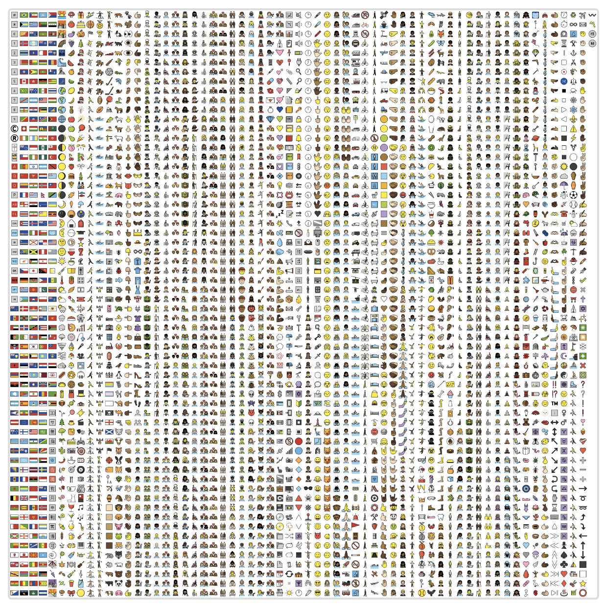

# emoji-datasource-openmoji

OpenMoji emoji images compatible with [emoji-datasource](https://www.npmjs.com/package/emoji-datasource): one full-resolution 128px image per emoji, plus 32px and 64px sprite sheets. Drop-in replacement for `emoji-datasource-apple`, `emoji-datasource-google`, or `emoji-datasource-twitter`.


## Features

- ✅ **128px individual images** for every emoji, named after emoji-datasource's `image` field
- ✅ **Full compatibility** with emoji-datasource grid layout (62x62) for the sprite sheets
- ✅ **3,786 emojis** including 1,875 skin tone variants, in both formats
- ✅ **Open source** OpenMoji 17 designs under CC-BY-SA 4.0
- ✅ **WebP format** for optimal compression

## Installation

```bash
npm install emoji-datasource-openmoji
```

or

```bash
pnpm add emoji-datasource-openmoji
```

## Usage

### Individual images (recommended)

Every emoji, including each skin tone variant, has its own 128×128 WebP at
`img/openmoji/128/<image>.webp`, where `<image>` is the entry's `image` field from
emoji-datasource with `.png` swapped for `.webp`:

```javascript
const emojiData = require('emoji-datasource');
const { imagePath } = require('emoji-datasource-openmoji');

const grinning = emojiData.find(e => e.short_name === 'grinning');
imagePath(grinning.image); // → .../img/openmoji/128/1f600.webp

const wave = emojiData.find(e => e.short_name === 'wave');
imagePath(wave.skin_variations['1F3FD'].image); // → .../img/openmoji/128/1f44b-1f3fd.webp
```

Or reference the files directly, for example with a bundler:

```javascript
const grinning = require('emoji-datasource-openmoji/img/openmoji/128/1f600.webp');
```

Prefer these over the sprite sheets when you can. Each emoji is rendered from the full
OpenMoji artwork at 128px, so it stays sharp at large sizes. You also avoid decoding a
whole 2108px or 4092px sheet just to show a single emoji. On iOS, a clipped sheet image
per emoji can exhaust memory.

### Sprite sheets as a drop-in replacement

If you're currently using `emoji-datasource-apple`:

```javascript
// Before
const emojiSheet = require('emoji-datasource-apple/img/apple/sheets/32.png');

// After
const emojiSheet = require('emoji-datasource-openmoji/img/sheets/32.webp');
```

### With emoji-datasource

```javascript
const emojiData = require('emoji-datasource');

// All emoji positions (sheet_x, sheet_y) from emoji-datasource
// work directly with the OpenMoji sprite sheets
const emoji = emojiData.find(e => e.short_name === 'grinning');
console.log(emoji.sheet_x, emoji.sheet_y); // Grid position in sprite sheet
```

### CSS Background Positioning

```css
.emoji {
  background-image: url('/path/to/emoji-sheet-32.webp');
  background-size: calc(34px * 62); /* (32px + 2px margin) * 62 grid cells */
  width: 32px;
  height: 32px;
}

.emoji-grinning {
  background-position-x: calc(var(--sheet-x) * -34px - 1px);
  background-position-y: calc(var(--sheet-y) * -34px - 1px);
}
```

## Available Images

- `img/openmoji/128/*.webp` - 3,786 individual 128×128px images (7.8 MB total)
- `img/sheets/32.webp` - 32×32px emojis (2108×2108px total, 1.2 MB)
- `img/sheets/64.webp` - 64×64px emojis (4092×4092px total, 2.8 MB)


### Full Sprite Sheet (62×62 grid)



## Building from Source

```bash
npm install
npm run build
```

This will:
1. Load emoji positions and image names from `emoji-datasource`
2. Load corresponding OpenMoji SVGs (the `openmoji` devDependency)
3. Generate sprite sheets at `img/sheets/*.webp`
4. Generate individual images at `img/openmoji/128/*.webp`

The build fails if any base emoji has no OpenMoji SVG. Output is deterministic, so
re-running produces no diff.

## Releasing

Releases are published from GitHub Actions using npm trusted publishing
(`.github/workflows/publish.yml`), with no npm token. Bump `version` in `package.json` on
`main`, then publish a GitHub release tagged `v<version>`.

## Grid Layout

The sprite sheets use a **62×62 grid** matching emoji-datasource:
- Each emoji has a 1px margin
- Cell size: emoji size + 2px margin
- Grid positions come from emoji-datasource's `sheet_x` and `sheet_y` values

## Skin Tone Support

All 1,875 skin tone variants are included:
- Fitzpatrick Type 1-2: 👋🏻
- Fitzpatrick Type 3: 👋🏼
- Fitzpatrick Type 4: 👋🏽
- Fitzpatrick Type 5: 👋🏾
- Fitzpatrick Type 6: 👋🏿

## License

- **Images (sprite sheets & individual files)**: CC-BY-SA 4.0
- **Build script** (`scripts/build.js`, not included in the npm package): AGPL-3.0-only
- **OpenMoji designs**: CC-BY-SA 4.0 ([OpenMoji](https://openmoji.org))
- **Emoji data**: MIT ([emoji-datasource](https://github.com/iamcal/emoji-data))

## Credits

- [OpenMoji](https://openmoji.org) - Beautiful open source emoji designs
- [emoji-datasource](https://github.com/iamcal/emoji-data) - Emoji metadata and grid positions
- Built for [Orbital](https://github.com/Pure-Karma-Labs/Orbital-Mobile) - Private family social network

## Related Projects

- [emoji-datasource](https://www.npmjs.com/package/emoji-datasource) - Emoji metadata
- [openmoji](https://www.npmjs.com/package/openmoji) - Individual OpenMoji SVGs
- [openmoji-sprites](https://www.npmjs.com/package/openmoji-sprites) - Category-based sprite sheets
